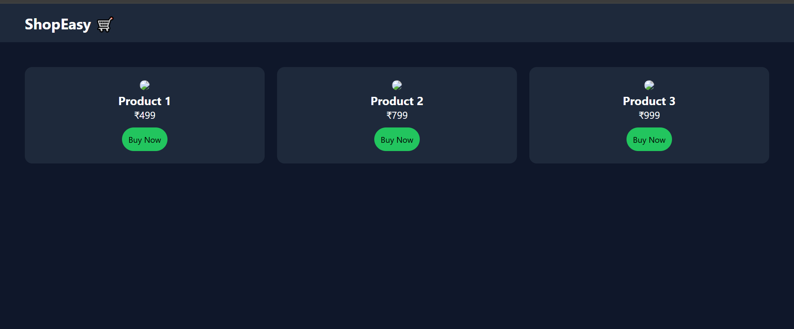

# 🛒 E-commerce Website UI - Day 1 Project 18

## 📌 Project Overview

This project is a modern **E-commerce Website UI** created as part of my semester challenge to build 200 websites.

It represents a simple online shopping interface with product listings, prices, and buy options.

---

## 🎯 Features

* 🛒 Product Listing Section
* 🖼️ Product Image Display
* 💰 Price Display
* 🛍️ Buy Now Button
* 📱 Responsive Grid Layout
* 🎨 Clean and Modern UI

---

## 🛠️ Technologies Used

* HTML5
* CSS3 (Grid)

---

## 📂 Project Structure

```id="8d2k1m"
site-18-ecommerce/
│
├── index.html
├── style.css
├── preview.png
└── README.md
```

---

## 📸 Preview




---

## 💡 Learning Outcome

* Learned product card design
* Practiced grid layout for multiple items
* Built shopping UI structure
* Improved UI/UX design skills
* Strengthened Git & GitHub workflow

---

## 🔥 Author

**Yash Patil**
Future Data Engineer 🚀

---

## ⭐ Note

This project is part of my goal to build **200 websites** to improve my web development and design skills.
